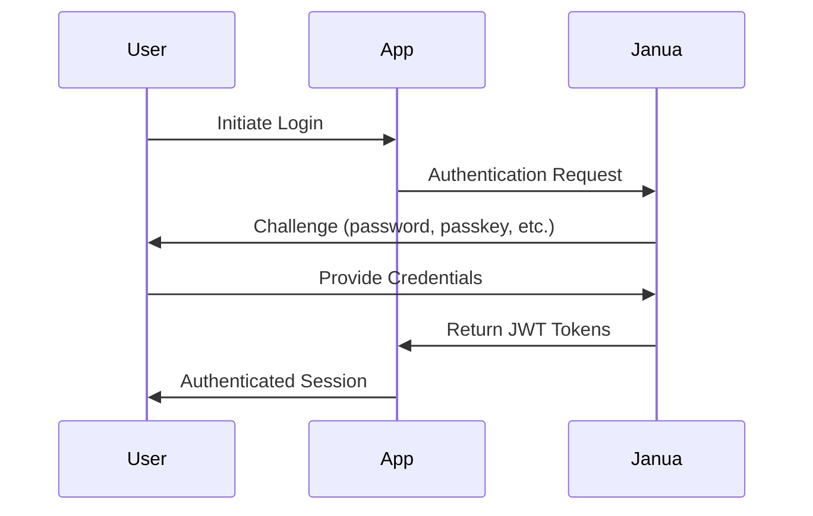

# Authentication Guide

Learn how to implement secure authentication in your application using Janua's flexible authentication system.

## Overview

Janua provides multiple authentication methods to suit different security requirements and user experiences:

- **Email/Password** - Traditional username and password authentication
- **Passkeys** - Modern passwordless authentication using WebAuthn
- **Social Login** - OAuth integration with popular providers
- **Multi-Factor Authentication** - Additional security layers
- **Magic Links** - Passwordless email-based authentication

## Authentication Flow

### Basic Authentication Process



### Token Management

Janua uses JWT tokens for authentication:

- **Access Token**: Short-lived (15 minutes) for API requests
- **Refresh Token**: Long-lived (7 days) for obtaining new access tokens
- **ID Token**: Contains user profile information

## Email/Password Authentication

### Implementation

```typescript
import \{ janua \} from '@/lib/janua'

// Sign up new user
async function signUp(email: string, password: string) \{
  try \{
    const result = await janua.signUp(\{
      email,
      password,
      // Optional user metadata
      metadata: \{
        firstName: 'John',
        lastName: 'Doe'
      \}
    \})
    
    return result
  \} catch (error) \{
    // Handle errors (user exists, weak password, etc.)
    console.error('Sign up failed:', error)
  \}
\}

// Sign in existing user
async function signIn(email: string, password: string) \{
  try \{
    const result = await janua.signIn(\{
      email,
      password
    \})
    
    // Store tokens securely
    localStorage.setItem('access_token', result.accessToken)
    localStorage.setItem('refresh_token', result.refreshToken)
    
    return result
  \} catch (error) \{
    // Handle invalid credentials
    console.error('Sign in failed:', error)
  \}
\}
```

### Password Requirements

Janua enforces strong password policies by default:

- Minimum 12 characters
- At least one uppercase letter
- At least one lowercase letter  
- At least one number
- At least one special character

You can customize these requirements in your Janua dashboard.

### Password Reset Flow

```typescript
// Request password reset
async function requestPasswordReset(email: string) \{
  try \{
    await janua.requestPasswordReset(\{ email \})
    // User will receive reset email
  \} catch (error) \{
    console.error('Password reset request failed:', error)
  \}
\}

// Reset password with token
async function resetPassword(token: string, newPassword: string) \{
  try \{
    await janua.resetPassword(\{
      token,
      newPassword
    \})
    // Password has been reset
  \} catch (error) \{
    console.error('Password reset failed:', error)
  \}
\}
```

## Passkeys Authentication

Passkeys provide passwordless authentication using WebAuthn for enhanced security and user experience.

### Enable Passkeys

First, enable passkeys in your Janua dashboard under Authentication Methods.

### Implementation

```typescript
// Register a new passkey
async function registerPasskey() \{
  try \{
    const result = await janua.registerPasskey(\{
      username: user.email,
      displayName: user.name
    \})
    
    console.log('Passkey registered successfully')
    return result
  \} catch (error) \{
    console.error('Passkey registration failed:', error)
  \}
\}

// Authenticate with passkey
async function authenticateWithPasskey() \{
  try \{
    const result = await janua.authenticateWithPasskey()
    
    // User authenticated successfully
    return result
  \} catch (error) \{
    console.error('Passkey authentication failed:', error)
  \}
\}

// Check passkey support
function isPasskeySupported() \{
  return janua.isPasskeySupported()
\}
```

### Conditional UI

Implement conditional UI to show passkey options only when supported:

```typescript
'use client'

import \{ useState, useEffect \} from 'react'

export function LoginForm() \{
  const [passkeysSupported, setPasskeysSupported] = useState(false)
  
  useEffect(() => \{
    setPasskeysSupported(janua.isPasskeySupported())
  \}, [])
  
  return (
    <div>
      \{passkeysSupported && (
        <button onClick=\{authenticateWithPasskey\}>
          Sign in with Passkey
        </button>
      )\}
      
      <form onSubmit=\{handlePasswordLogin\}>
        \{/* Email/password form */\}
      </form>
    </div>
  )
\}
```

## Social Login

Integrate with popular OAuth providers for seamless user onboarding.

### Supported Providers

- Google
- GitHub
- Microsoft
- Apple
- Discord
- Twitter/X
- LinkedIn

### Configuration

1. Enable social providers in your Janua dashboard
2. Configure OAuth app credentials for each provider
3. Set up redirect URIs

### Implementation

```typescript
// Initiate social login
async function signInWithGoogle() \{
  try \{
    const result = await janua.signInWithProvider('google')
    // User will be redirected to Google
  \} catch (error) \{
    console.error('Social login failed:', error)
  \}
\}

// Handle callback
async function handleSocialCallback() \{
  try \{
    const result = await janua.handleCallback()
    // User authenticated via social provider
    return result
  \} catch (error) \{
    console.error('Social callback failed:', error)
  \}
\}
```

### React Component Example

```tsx
import \{ GoogleIcon, GitHubIcon \} from '@/components/icons'

export function SocialLogin() \{
  return (
    <div className="space-y-3">
      <button
        onClick=\{() => janua.signInWithProvider('google')\}
        className="w-full flex items-center justify-center gap-3 px-4 py-2 border border-gray-300 rounded-md hover:bg-gray-50"
      >
        <GoogleIcon className="w-5 h-5" />
        Continue with Google
      </button>
      
      <button
        onClick=\{() => janua.signInWithProvider('github')\}
        className="w-full flex items-center justify-center gap-3 px-4 py-2 border border-gray-300 rounded-md hover:bg-gray-50"
      >
        <GitHubIcon className="w-5 h-5" />
        Continue with GitHub
      </button>
    </div>
  )
\}
```

## Multi-Factor Authentication (MFA)

Add an extra layer of security with MFA.

### Enable MFA

```typescript
// Enable MFA for a user
async function enableMFA() \{
  try \{
    const result = await janua.enableMFA()
    
    // Show QR code for authenticator app
    console.log('MFA Secret:', result.secret)
    console.log('QR Code URL:', result.qrCodeUrl)
    
  \} catch (error) \{
    console.error('MFA enable failed:', error)
  \}
\}

// Verify MFA setup
async function verifyMFA(code: string) \{
  try \{
    await janua.verifyMFA(\{ code \})
    console.log('MFA verified successfully')
  \} catch (error) \{
    console.error('MFA verification failed:', error)
  \}
\}
```

### MFA Login Flow

```typescript
async function signInWithMFA(email: string, password: string) \{
  try \{
    const result = await janua.signIn(\{ email, password \})
    
    if (result.requiresMFA) \{
      // Prompt user for MFA code
      const mfaCode = await promptForMFACode()
      
      const finalResult = await janua.verifyMFA(\{
        code: mfaCode,
        sessionToken: result.sessionToken
      \})
      
      return finalResult
    \}
    
    return result
  \} catch (error) \{
    console.error('MFA login failed:', error)
  \}
\}
```

## Magic Links

Passwordless authentication via email links.

### Implementation

```typescript
// Send magic link
async function sendMagicLink(email: string) \{
  try \{
    await janua.sendMagicLink(\{ email \})
    console.log('Magic link sent to', email)
  \} catch (error) \{
    console.error('Magic link failed:', error)
  \}
\}

// Verify magic link
async function verifyMagicLink(token: string) \{
  try \{
    const result = await janua.verifyMagicLink(\{ token \})
    // User authenticated via magic link
    return result
  \} catch (error) \{
    console.error('Magic link verification failed:', error)
  \}
\}
```

## Session Management

### Check Authentication Status

```typescript
// Check if user is authenticated
async function checkAuth() \{
  try \{
    const session = await janua.getSession()
    
    if (session) \{
      console.log('User is authenticated:', session.user)
      return session
    \} else \{
      console.log('User is not authenticated')
      return null
    \}
  \} catch (error) \{
    console.error('Auth check failed:', error)
    return null
  \}
\}

// Get user profile
async function getUserProfile() \{
  try \{
    const user = await janua.getUser()
    return user
  \} catch (error) \{
    console.error('Failed to get user:', error)
  \}
\}
```

### Token Refresh

```typescript
// Manually refresh tokens
async function refreshTokens() \{
  try \{
    const result = await janua.refreshToken()
    
    // Update stored tokens
    localStorage.setItem('access_token', result.accessToken)
    localStorage.setItem('refresh_token', result.refreshToken)
    
    return result
  \} catch (error) \{
    // Refresh failed, redirect to login
    window.location.href = '/login'
  \}
\}

// Auto-refresh tokens before expiry
janua.onTokenExpired(() => \{
  refreshTokens()
\})
```

### Sign Out

```typescript
async function signOut() \{
  try \{
    await janua.signOut()
    
    // Clear local storage
    localStorage.removeItem('access_token')
    localStorage.removeItem('refresh_token')
    
    // Redirect to login
    window.location.href = '/login'
  \} catch (error) \{
    console.error('Sign out failed:', error)
  \}
\}
```

## Error Handling

### Common Authentication Errors

```typescript
import \{ JanuaError \} from '@janua/nextjs'

try \{
  await janua.signIn(\{ email, password \})
\} catch (error) \{
  if (error instanceof JanuaError) \{
    switch (error.code) \{
      case 'INVALID_CREDENTIALS':
        setError('Invalid email or password')
        break
      case 'USER_NOT_FOUND':
        setError('No account found with this email')
        break
      case 'TOO_MANY_ATTEMPTS':
        setError('Too many failed attempts. Please try again later.')
        break
      case 'MFA_REQUIRED':
        setShowMFAPrompt(true)
        break
      default:
        setError('An unexpected error occurred')
    \}
  \}
\}
```

### Rate Limiting

Janua automatically handles rate limiting for authentication attempts:

- **Failed login attempts**: 5 attempts per 15 minutes per IP
- **Password reset requests**: 3 requests per hour per email
- **MFA attempts**: 5 attempts per 15 minutes per user

## Security Best Practices

### 1. Secure Token Storage

```typescript
// ❌ Don't store tokens in localStorage in production
localStorage.setItem('access_token', token)

// ✅ Use secure HTTP-only cookies
// This is handled automatically by Janua SDKs
```

### 2. Validate Tokens Server-Side

```typescript
// API route protection
export async function GET(request: NextRequest) \{
  const session = await janua.getSession(request)
  
  if (!session) \{
    return new Response('Unauthorized', \{ status: 401 \})
  \}
  
  // Session is validated and user is authenticated
  return Response.json(\{ user: session.user \})
\}
```

### 3. Implement Proper Logout

```typescript
// ✅ Always call server-side logout
async function logout() \{
  await janua.signOut() // Invalidates tokens server-side
  window.location.href = '/login'
\}
```

## Next Steps

- [Session Management](/guides/sessions) - Learn about managing user sessions
- [User Management](/guides/users) - Handle user profiles and metadata
- [Security Best Practices](/guides/security) - Secure your application
- [Organization Management](/guides/organizations) - Multi-tenant applications

## Troubleshooting

### Common Issues

**Authentication fails silently**
- Check browser console for errors
- Verify environment variables are set correctly
- Ensure redirect URIs match your configuration

**Passkeys not working**
- Verify HTTPS is enabled (required for WebAuthn)
- Check browser compatibility
- Ensure origin matches registered domain

**Social login redirects to wrong URL**
- Verify redirect URIs in provider configuration
- Check environment-specific settings
- Ensure HTTPS for production

For more help, check our [troubleshooting guide](/guides/troubleshooting) or [contact support](mailto:support@janua.dev).